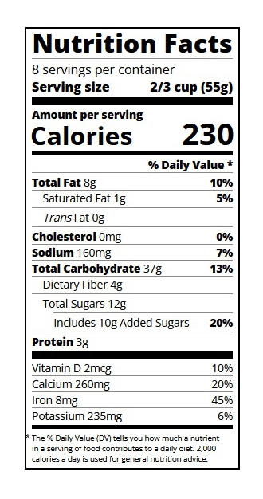
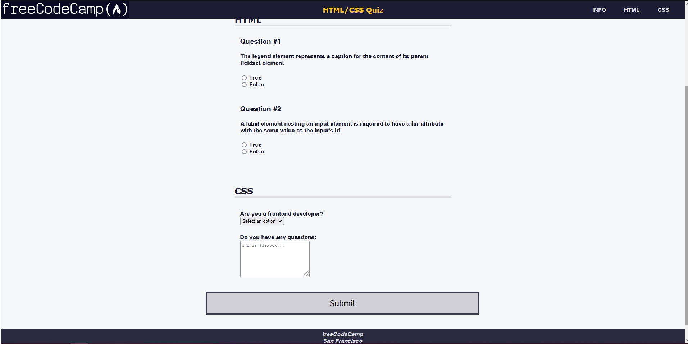
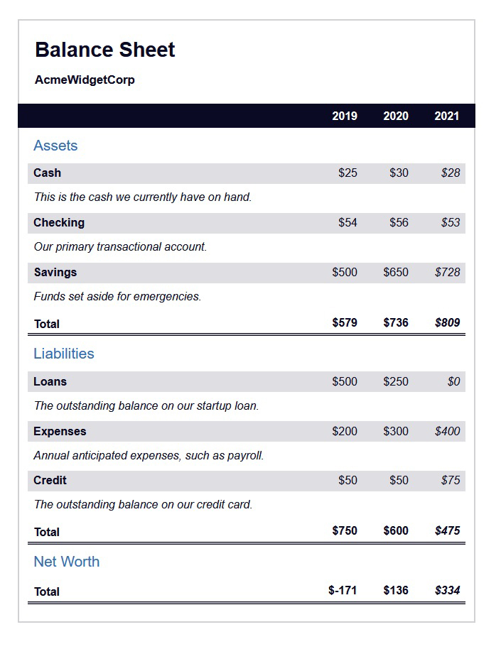
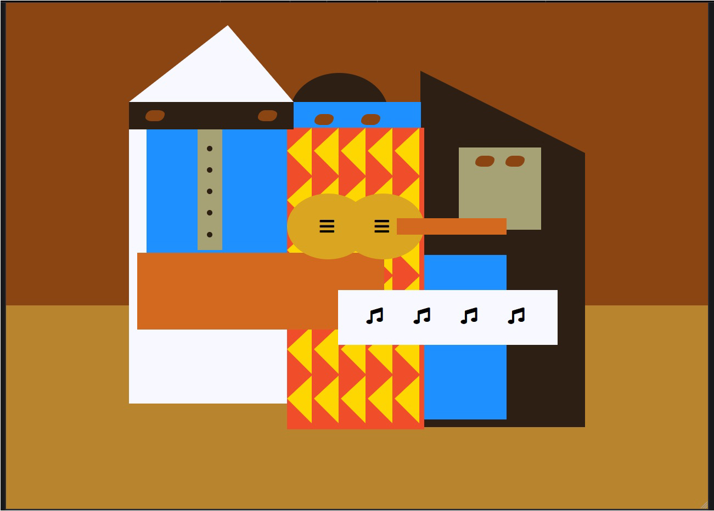
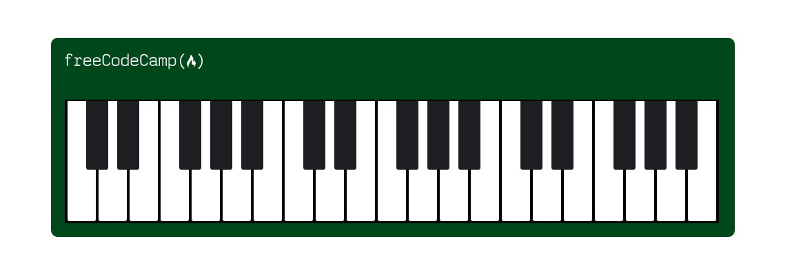

# freeCodeCamp-projects
These are some selected projects from FCC that are very good for beginners to experts. Various important techniques have been applied in these projects.

## Nutrition

Useful techniques: typography, intelligent use of \
 elements.

## HTML-CSS Quiz

Useful techniques: form styling, navigation bar styling, footer styling.

## Balance Sheet

Useful techniques: creating styling table, making tables more accessible(this is implemented vey nicely), flexbox techniques.

## Picasso Painting

Useful techniques: positioning, making complex design using HTML elements.

## Piano

Useful techniques: use of psuedo-elements, positioning.

