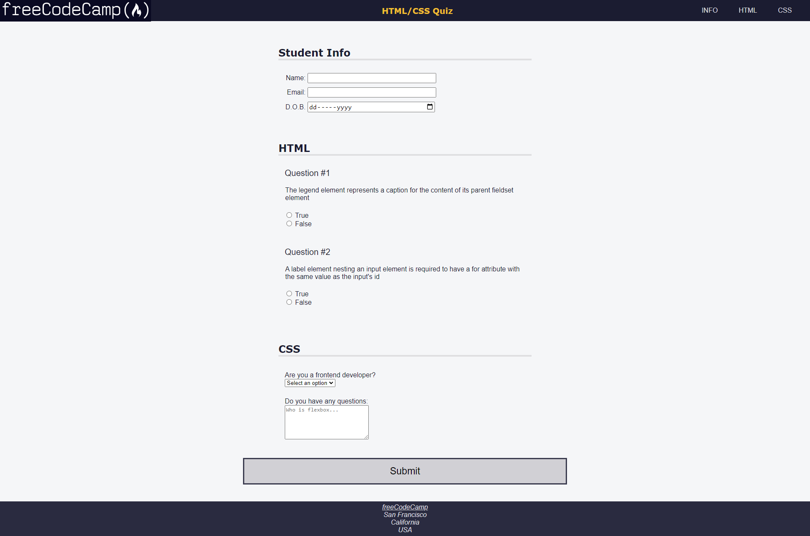
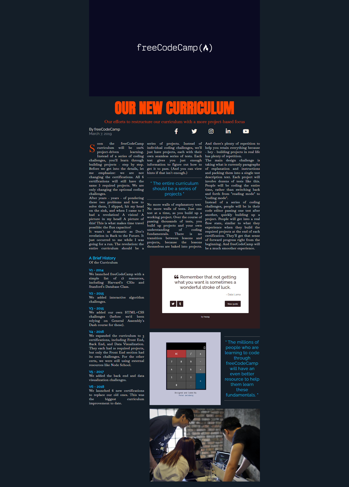

# freeCodeCamp-projects
These are some selected projects from FCC that are very good for beginners to experts. Various important techniques have been applied in these projects.

## Nutrition

Useful techniques: typography, intelligent use of \
 elements, float.

## HTML-CSS Quiz

Useful techniques: form styling, navigation bar styling, footer styling.

## Balance Sheet

Useful techniques: creating styling table, making tables more accessible(this is implemented vey nicely), flexbox techniques.

## Picasso Painting

Useful techniques: positioning, making complex design using HTML elements.

## Piano

Useful techniques: use of psuedo-elements, positioning.

## City Skyline

Useful techniques: Representing a responsive art, various gradients, CSS variables, day-night mode.

## Magazine

Useful techniques: grid, column-layout, typography. float.

## Ferris Wheel

Useful techniques: animation, transformation.

## Penguin

Useful techniques: Building a whole penguin, animation, transformation, transition.

